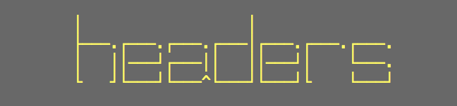
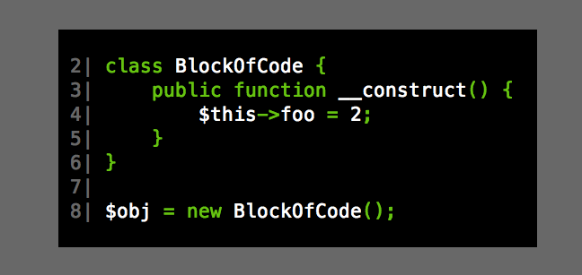

ANSISlides
==============================

ANSISlides is a Terminal presentation application written in PHP.

The motivation of this tools was made shomething fun and fresh for my presentation in the [deSymfonyDay 2014](http://day.desymfony.com/). The abstraction not is very good for lack of time. Don't judge me for this code.

Requirements
------------

* PHP 5.4.x

Installation
------------

Assuming you have git and composer installed execute:

```sh
git clone git@github.com:mcuadros/ansi-slides.git
cd ansi-slides
composer install
```

Usage
-----

```./bin/ansislide play example/example.md```


Format
------

The format of the presentations is something similar to Markdown, with some tricks and hacks.

### Headers
```
# Header
```



### Small headers
```
## Small headers
```


### Code Highlighting
<pre lang="no-highlight"><code>
```php
class BlockOfCode {
    public function __construct() {
        $this->foo = 2;
    }
}

$obj = new BlockOfCode();
```
</code></pre>



### ANSI Colors
```


```


### Emphasis
```
Emphasis: **underline**

```


### Lists
```
- Lists
- Items are showed
- One by one

```


### Images
```

```

This only works at [iTerm2](http://www.iterm2.com/#/section/home), inspired by [tkn](https://github.com/fxn/tkn)

License
-------

MIT, see [LICENSE](LICENSE)
