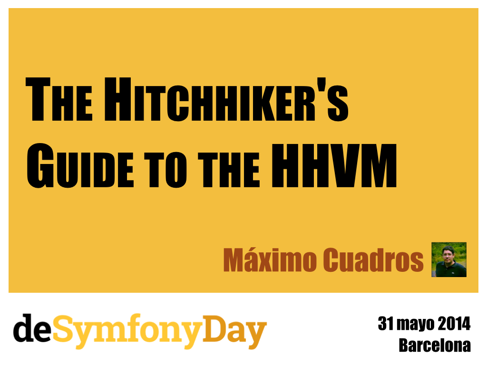

---

---
# Quien os habla?
Máximo Cuadros
CTO en Yunait
Trabajando con PHP desde 1998
Contribuidor principal del driver MongoDB para HHVM
Contribuidor en muchos proyectos OSS
---
# Que es HHVM?
---
## HHVM = HipHop Virtual Machine
- Maquina virtual para PHP creada por **Facebook**

- Creado con el objetivo de ser mucho **más rápido** que Zend Engine y **compatible** con PHP.

- Interprete del nuevo lenguaje de programación: Hack

- Liberado bajo licencia PHP y Zend, en el 2010
---
## Historia
- Facebook tiene más **20 millones** de lineas de código en PHP lo que hace impensable rescribirlo.

- En el **2008** nace el proyecto HPHPc, a nivel interno, para aumentar el rendimiento de su plataforma.

- En el **2010** se hace público HPHPc y se comienza con el desarrollo de HHVM, igualando el rendimiento de HPHPc en el **2012**

- En el **2013** la plataforma de Facebook empieza a usar HHVM y se declara obsoleto HPHPc
---
## Virtual Machine
- Compila PHP a **código máquina x64** con un compilador just-in-time (JIT)

- Muy similar a la máquinas virtuales de otros lenguajes como: Java o C#

- **Cachea** el código máquina en SQLite, similar a APC o OPCache.
---
## Interfaces
- Incorpora un interprete command line como PHP

- El interface fastcgi sustituye a PHP-FPM, pudiendo servir páginas a través de un Nginx o Apache
---
# En la practica
---
## Performance
- La plataforma de Facebook, se ejecuta **9x** veces más rápido y consume **5x** menos memoria, comparado con PHP 5.2 + APC (2013)

- En **realidad** las mejoras son de **1.5x** a **3x** veces

```
┌───────────────────────────────┬────────────┬───────┐
│ Code @ VM                     │ Ops/second │ Ratio │
├───────────────────────────────┼────────────┼───────┤
│ Doctrine @ PHP 5.5.9          │ 50.61529   │ 1.00x │
├───────────────────────────────┼────────────┼───────┤
│ Doctrine @ HipHop VM 3.0.0    │ 146.85877  │ 2.90X │
└───────────────────────────────┴────────────┴───────┘
https://gist.github.com/mcuadros/9633632
```
---
## Compatibilidad
- Más de **23 frameworks** y librerias funcionan al 100%, laravel, drupal, composer, phpbb3, doctrine2, twig, etc

- Y muchos otros superán los test en un 93%, como es el caso de **symfony** que los pasas en un 98.95%


---

## Entendiendo JIT
---
```
                    ┌─────────────┐
                    │ Lex./Parser │
                    └──────┬──────┘


```


---
- El verdadero **beneficio** de JIT se obtiene en código que es iterado múltiples veces.

- En consecuencia, un código que se ejecute **pocas veces**, será penalizado por el overhead de cachear el código máquina.

- Peticiones Warnup: HHVM generará la cache después de n peticiones (por defecto 11), estás peticiones son usadas para estudiar el código y generar código optimizado.


---
## Extensiones
- HHVM soporta **extensiones dinámicas** de igual manera que lo hace PHP

- Pueden ser escritas en **PHP, Hack o C++** o una combinación de las 3

- Son muy **facililes e intiutivas** de escribir, muy similar a PHP-CPP
---
```php
static Array HHVM_FUNCTION(add, const String& name, const String& value) {
  Array output = Array();
  output.add(name, value)

  return output;
}
```
---
## Instalación
- **Linux**: hay repositorios/paquetes para las principales distribuciónes Ubuntu, Debian, Fedora, Mint, CentOs (unofficial)

- **OSX**: desde brew se puede compilar facilmente, con el tap: https://github.com/mcuadros/homebrew-hhvm (unofficial)

- **Windows**: unsupported (es realmente eso un problema? :D)

- **Vagrant**: la mejor opción para usuarios de OSX y Windows https://github.com/vicb/hhvm-vagrant
---
# HACK Lang
---
## Type hinting
- Type hinting de **escalares**: bool, int, float, string

- **Return type hinting** (todos los tipos además de void y this)

- Propiedades de clase tipadas

- Promoción de argumentos desde el constructor
---
```php
class Arithmetic {
    public function __construct(protected int $value): void { }

    public function multiply(int $by): this {
        $this->value *= $by;
        return $this;
    }

    public function get(): int {
        return $this->value;
    }
}

$foo = new Arithmetic(2);
$foo->multiply(3)->multiply(5);
echo $foo->get(); // Returns: 30
```
---
## Genericos
```php
class MiGenerico<T> {
    public function __construct(private T $value): void {
        $this->data = $value;
    }

    public function get(): T {
        return $this->data;
    }
}

$genericInt = new MiGenerico<int>(1);
$genericString = new MiGenerico<string>('foo');
```
---
## Colecciones
- **Vector**: Lista ordenada de valores, del mismo tipo


- **Map**: Diccionario ordenado, los valores han de ser del mismo tipo y claves de tipo int o string


- **Set**: Grupo ordenado de valores únicos de enteros o strings.


- **Pair**: Un par de valores de cualquier tipo, inmutable.

---
## Y mucho más
Tipos nullables
Funciones asincronas
Alias de tipos
---
## Y todo esto para que?
```
┌───────────────────────────────┬──────────┬───────┐
│ Code @ VM                     │ Elapsed  │ Ratio │
├───────────────────────────────┼──────────┼───────┤
│ Pimple @ PHP 5.3.10           │ 0m4.753s │ 
├───────────────────────────────┼──────────┼───────┤
│ Pimple @ PHP 5.5.12           │ 0m2.764s │ 1.00x │
├───────────────────────────────┼──────────┼───────┤
│ Pimple @ HipHop VM 3.0.0      │ 0m2.087s │ 
├───────────────────────────────┼──────────┼───────┤
│ pimple-hack @ HipHop VM 3.0.0 │ 0m1.451s │ 
└───────────────────────────────┴──────────┴───────┘
```
---
# El futuro
---
## El core esta divido

- (2/Nov/2013) **Joe Watkins** #9 567 commits**


- (3/Sep/2013) **Anthony Ferrara** #39 45 commits


---
## Y algo tiene que cambiar

- HHVM es un gran **toque de atención**. Una de las empresas más grandes de internet esta dedicando mucho esfuerzo y dinero para mejorar PHP.

- **No es el único** interprete alternativo kPHP, HippyVM, JPHP.

- **PHP tiene que mejorar!**
---
## Y parece que lo esta haciendo

- Return Type Declarations


- Constructor Promoted Arguments


- Nombres de funciones consistentes


- PHP-CPP: Creación de extensiones de una manera facil.


- PHPNG: Una vuelta de tuerca de Zend Engine para 5.7

---
# Preguntas?
---
# Muchas gracias!
## Referencias y fuentes
http://bit.ly/1nUb78b

## Contacto
Twitter: @mcuadros_
Github: https://github.com/mcuadros

