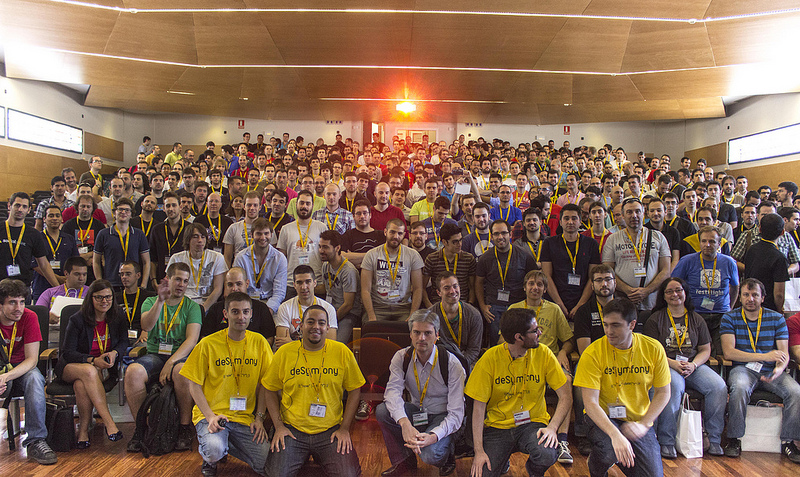

![green,black]
# The Hitchhiker's
# Guide to the HHVM
## Por Máximo Cuadros / @mcuadros_
---
![yellow,black]
# Sobre mi
* Máximo Cuadros
* CTO en Yunait
* Trabajando con PHP desde 1998
* Contribuidor principal del driver MongoDB para HHVM
* Contribuidor en muchos proyectos OSS
---
![white,blue]
# Que es HHVM?
---
![white,blue]
## Implementación alternativiva de PHP
![yellow,blue]* Proyecto OSS iniciado por Facebook, con una activa comunidad.

![yellow,blue]* La funcionalidad de PHP 5.4 esta soportada casi por completo

![yellow,blue]* Las principales extensions han sido portadas.
---
![white,blue]
## Historia
![yellow,blue]* Facebook tiene más 20 millones de lineas de código en PHP
![yellow,blue]lo que hace impensable rescribirlo.

![yellow,blue]* En el 2008 nace el proyecto HPHPc, a nivel interno, para
![yellow,blue]aumentar el rendimiento de su plataforma.

![yellow,blue]* En el 2010 se hace público HPHPc y se comienza con el
![yellow,blue]desarrollo de HHVM, igualando el rendimiento de HPHPc en el 2012

![yellow,blue]* En el 2013 la plataforma de Facebook empieza a usar HHVM
![yellow,blue]y se declara obsoleto HPHPc
---
![white,blue]
## HipHop Virtual Machine
![yellow,blue]* Compila PHP a código máquina x64 con
![yellow,blue]un compilador just-in-time (JIT)

![yellow,blue]* Muy similar a la máquinas virtuales
![yellow,blue]de otros lenguajes como: Java/JVM o C#/CLR

![yellow,blue]* Cachea el código máquina en SQLite,
![yellow,blue]similar a APC o OPCache.
---
![white,blue]
## CLI & Fastcgi server
![yellow,blue]* Incorpora un interprete command line como PHP

![yellow,blue]* El servidor Fastcgi sustituye a PHP-FPM
---
![green,black]
# En la practica
---
![green,black]
## Performance
![yellow,black]* La plataforma de Facebook, se ejecuta 9x veces más rapido y
![yellow,black] consume 5x menos memoria, comparado con PHP 5.2 + APC (2013)

![yellow,black]* En realizad las mejoras son de 1.5x a 3x veces

```
┌───────────────────────────────┬────────────┬───────┐
│ Code @ VM                     │ Ops/second │ Ratio │
├───────────────────────────────┼────────────┼───────┤
│ Doctrine @ PHP 5.5.9          │ 50.61529   │ 1.00x │
├───────────────────────────────┼────────────┼───────┤
│ Doctrine @ HipHop VM 3.0.0    │ 146.85877  │ 2.90X │
└───────────────────────────────┴────────────┴───────┘
https://gist.github.com/mcuadros/9633632
```
---
![green,black]
## Compatibilidad
![yellow,black]* Más de 23 frameworks y librerias funcionan al 100%,
![yellow,black]laravel, drupal, composer, phpbb3, doctrine2, twig, etc

![yellow,black]* Otros muchos superán los test en un 93%, como es el caso
![yellow,black]de symfony que los pasas en un 98.95%


Datos obtenidos de:
http://www.hhvm.com/frameworks/
actualización 2014-05-21
---
![green,black]
## Sobre JIT
---
![green,black]
```
┌─────────────┐
│   Lexing    │
└──────┬──────┘
┌──────┴──────┐
│   Parsing   │
└──────┬──────┘
┌──────┴──────┐
│ Compilation ├───┐
└─────────────┘   │  ┌──────────────┐
                  ├──┤ OpCode Cache │
┌─────────────┐   │  └──────────────┘
│  Execution  ├───┘
└─────────────┘
```
---
![green,black]
```
.                 ┌─────────────┐
               ┌──┤   Lexing    │
┌───────────┐  │  └─────────────┘
│    AST    ├──┤
└───────────┘  │  ┌─────────────┐
               └──┤   Parsing   │
                  └──────┬──────┘
                  ┌──────┴──────┐      ┌──────────────┐
                  │ Compilation ├──────┤  OpCode Gen. │
                  └─────────────┘      └──────┬───────┘
                                       ┌──────┴───────┐
                                       │ JIT Compiler │
                                       └──────┬───────┘
                  ┌─────────────┐      ┌──────┴───────┐
                  │  Execution  ├──────┤ x64 Code Re. │
                  └─────────────┘      └──────────────┘
```
ElePHPants on speed: Running TYPO3 Flow on HipHop VM
by Martin Helmich
---
![green,black]
![yellow,black]* Para exprimir las ventajas de JIT el código debe de
![yellow,black]ser ejecutado muchas iteraciónes

![yellow,black]* Un código que se ejecute pocas veces, irá más lento
![yellow,black]debido al overhead de cachear el codigo máquina.

![yellow,black]* Eval.JitWarmupRequests, por defecto es 11, estás
![yellow,black]peticiones son usadas para estudiar el código y generar
![yellow,black]un código optimizado.

http://stackoverflow.com/questions/17898783/hhvm-poor-performance
---
![green,black]
## Instalación
![yellow,black]* Linux: hay repositorios/paquetes para las principales
![yellow,black]distribuciónes Ubuntu, Debian, Fedora, Mint, CentOs (unofficial)

![yellow,black]* OSX: desde brew se puede compilar facilmente, con el tap:
![yellow,black]https://github.com/mcuadros/homebrew-hhvm (unofficial)

![yellow,black]* Windows: unsupported (this is a problem?)

![yellow,black]* Vagrant: la mejor opción para usuarios de OSX y Windows
![yellow,black]https://github.com/vicb/hhvm-vagrant
---
# algo de codigo

```php
protected function align($text, $path = STR_PAD_RIGHT)
{
    $result = [];
    foreach (explode("\n", $text) as $line) {
        $result[] = $line;
    }

    return implode("\n", $result);
}
```
---

---
# Test
1. Una prueba
2. Otra prueba
---
# A table
```
┌───────────────────────────────┬──────────┬───────┐
│ Code @ VM                     │ Elapsed  │ Ratio │
├───────────────────────────────┼──────────┼───────┤
│ Pimple @ PHP 5.3.10           │ 0m4.753s │ 1.00x │
├───────────────────────────────┼──────────┼───────┤
│ Pimple @ HipHop VM 3.0.0      │ 0m2.458s │ 1.91X │
├───────────────────────────────┼──────────┼───────┤
│ pimple-hack @ HipHop VM 3.0.0 │ 0m1.729s │ 2.74x │
└───────────────────────────────┴──────────┴───────┘
```
